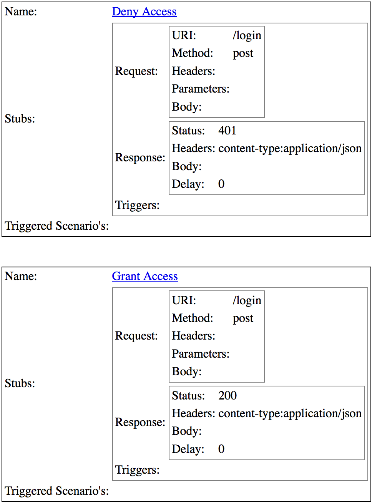

http_stub
=========

```fakeweb``` for a HTTP server, informing it to 'fake', or, in the test double vernacular - 'stub' - responses.

Status
------

[](https://travis-ci.org/MYOB-Technology/http_stub)
[](http://badge.fury.io/rb/http_stub)
[](https://codeclimate.com/github/MYOB-Technology/http_stub)
[](https://codeclimate.com/github/MYOB-Technology/http_stub/coverage)
[](https://gemnasium.com/MYOB-Technology/http_stub)

Motivation
----------

Need to simulate a HTTP service with which your application integrates?  Enter ```http_stub```.

```http_stub``` is similar in motivation to the ```fakeweb``` gem, although ```http_stub``` provides a separately 
running HTTP process whose responses can be faked / stubbed.

Alternatives and Comparisons
----------------------------

### [Pact](https://github.com/realestate-com-au/pact)
Facilitates consumer driven contracts by allowing consumers to define a contract that is shared and verified by producers.

In comparison ```http_stub```:
* Simulates a provider via an external process.  On-the-fly changes to responses are possible to aid exploratory testing and demonstrations.
* Is flexible in matching requests to responses through the use of match clauses, such as regular expressions and mandatory omissions.  Requests can also be matched against JSON schemas.

It's important to note that ```http_stub``` presently does not aid producers in verifying consumer expectations.
At best, ```http_stub``` allows consumers to share actual requests and responses with producers through its administrative screens.

### [VCR](https://github.com/vcr/vcr)
Records requests and responses onto 'cassettes'.  Replays responses in-process by mocking HTTP libraries in use.

In comparison ```http_stub```:
* Relies on an external HTTP server and does not effect HTTP libraries in use.
* Facilitates TDD/BDD style testing by not relying on real integrations being recorded and pre-existing.
* Can make it easier to write and alter requests and responses by not having to alter or re-record cassettes and recordings.

### [http-stub-server](https://github.com/Sensis/http-stub-server)
Similiar in spirit, implemented in Java and comes with Java and Ruby clients.

In comparison ```http_stub```:
* Has the concept of scenarios that allow on-the-fly changes to responses.  This aids automated testing, exploratory testing and demonstrations.
* Supports a wider range of matching rules and can match requests against JSON schemas.
* Supports multi-part file responses.
* Has administration pages to interrogate the state of the stub, observe requests and responses made, and activate scenarios on-the-fly.
* Has an elegant Ruby DSL that aids in keeping requests and responses DRY.

### [HTTParrot](https://github.com/abrandoned/httparrot)
Similar in spirit, implemented in Ruby, but has limited functionality and has been discontinued.

### [Rack Stubs](https://github.com/featurist/rack-stubs)
Similar in spirit, implemented as Rack Middleware, but has limited functionality and has been discontinued.

Design
------

```http_stub``` is composed of two parts:
* A HTTP server (Sinatra) that replays known responses when an incoming request matches defined criteria.  The server 
  is run in a dedicated - external - process to the system under test to better simulate the real architecture. 
* A Ruby DSL used to configure the server known as a ```Configurer```

Usage
-----

To simulate common respones from an authentication service, let's stub a service which will respond to a login request
by either granting or denying access:

```ruby
class AuthenticationServiceConfigurer
  include HttpStub::Configurer

  stub_server.port = 8000

  login_template = stub_server.endpoint_template { match_requests(uri: "/login", method: :post) }

  login_template.add_scenario!("grant_access", status: 200)
  login_template.add_scenario!("deny_access",  status: 401)
  
end
```

Now we can initialize the service and activate the scenarios as needed.

```ruby
AuthenticationServiceConfigurer.initialize!
AuthenticationServiceConfigurer.stub_server.activate!("grant_access")
```

Navigating to the locally running stub server (e.g. ```http://localhost:8000/http_stub/scenarios```) reveals the scenarios
which we can activate manually by clicking the links.



```http_stub``` can match requests against a variety of criteria, including JSON schemas, and can respond with arbitrary
content including files.

See the [wiki](https://github.com/MYOB-Technology/http_stub/wiki) for more usage details and examples.

Installation
------------

In your Gemfile include:

```ruby
    gem 'http_stub'
```

Requirements
------------

* Ruby >= 1.9.3
* A Rack server
