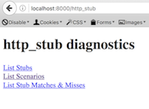
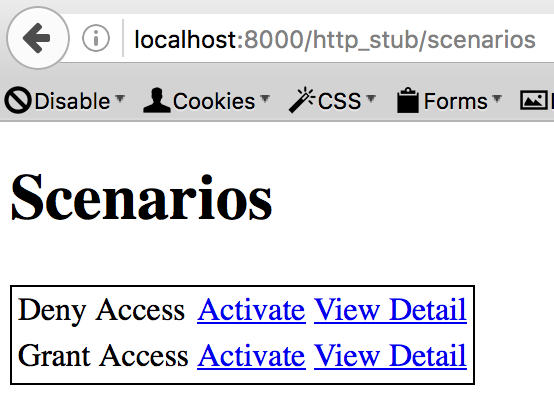

http_stub
=========

```fakeweb``` for a HTTP server, informing it to 'fake', or, in the test double vernacular - 'stub' - responses.

Status
------

[](https://travis-ci.org/MYOB-Technology/http_stub)
[](http://badge.fury.io/rb/http_stub)
[](https://codeclimate.com/github/MYOB-Technology/http_stub)
[](https://codeclimate.com/github/MYOB-Technology/http_stub/coverage)
[](https://gemnasium.com/MYOB-Technology/http_stub)

Motivation
----------

Need to simulate a HTTP service with which your application integrates?  Enter ```http_stub```.

```http_stub``` is similar in motivation to the ```fakeweb``` gem, although ```http_stub``` provides a separately 
running HTTP process whose responses can be faked / stubbed.

Alternatives and Comparisons
----------------------------

### [Pact](https://github.com/realestate-com-au/pact)
Facilitates consumer driven contracts by allowing consumers to define a contract that is shared with and verified by producers.

In comparison ```http_stub```:
* Supports on-the-fly changes to responses to aid exploratory testing and demonstrations.
* Supports specification based contracts in addition to example based contracts.  Incoming requests can be matched through the use of clauses such as regular expressions and JSON schema definitions.
* See comparison with ```http-stub-server``` for more highlights.

```http_stub``` can be used for Consumer & Producer contract verification.
For more information, see the dedicated [Slide Deck](https://docs.google.com/presentation/d/18iikw5rXuHNt7TxmAuiak9kFXR3wmObMMB1jlqrrwbQ/edit?usp=sharing) & [Wiki Page](https://github.com/MYOB-Technology/http_stub/wiki/Contract-Based-Testing-Recommendations).

### [VCR](https://github.com/vcr/vcr)
Records requests and responses onto 'cassettes'.  Replays responses in-process by mocking HTTP libraries in use.

In comparison ```http_stub```:
* Relies on an external HTTP server and does not effect HTTP libraries in use.
* Facilitates TDD/BDD style testing by not relying on real integrations being recorded and pre-existing.
* Can make it easier to write and alter requests and responses by not having to alter or re-record cassettes / recordings.

### [http-stub-server](https://github.com/Sensis/http-stub-server)
Similiar in spirit, implemented in Java and comes with Java and Ruby clients.

In comparison ```http_stub```:
* Has the concept of scenarios that allow on-the-fly changes to responses.  This aids automated testing, exploratory testing and demonstrations.
* Supports a wider range of matching rules and can match requests against JSON schemas.
* Supports references to request headers and parameters in responses.
* Supports multi-part file responses.
* Allows cross-origin request support to be enabled easily.
* Allows a match to trigger the registration of other ```stubs``` to simulate state changes in the provider.
* Has diagnostic pages to interrogate the state of the stub, trace requests to responses, and activate scenarios on-the-fly.
* Has an elegant Ruby DSL that aids in keeping requests and responses DRY.

### [HTTParrot](https://github.com/abrandoned/httparrot), [Rack Stubs](https://github.com/featurist/rack-stubs), [mock_server](https://github.com/unixcharles/mock_server)
These are similar in spirit, implemented in Ruby, but have limited functionality and have been discontinued.

Design
------

```http_stub``` is composed of two parts:
* A HTTP server (Sinatra) that replays known responses when an incoming request matches defined criteria.  The server 
  is run in a dedicated - external - process to the system under test to better simulate the real architecture. 
* A Ruby DSL used to configure the server known as a ```Configurer```

Usage
-----

## Step 1: Define The Server Configuration ##

To simulate a response from an authentication service, let's stub the service and respond to it's login endpoint by
either granting or denying access:

```ruby
module AuthenticationService

  class Configurer
    include HttpStub::Configurer

    login_template = stub_server.endpoint_template { match_requests(uri: "/login", method: :post) }

    login_template.add_scenario!("Grant access", status: 200)
    login_template.add_scenario!("Deny access",  status: 401)
  end

end
```

## Step 2: Start The Server ##

Define tasks to manage the servers lifecycle:

```ruby
  require 'http_stub/rake/task_generators'

  configurer = AuthenticationService::Configurer
  configurer.stub_server.host = "localhost"
  configurer.stub_server.port = 8000

  HttpStub::Rake::ServerDaemonTasks.new(name: :authentication_service, configurer: configurer)
```

Then start the server:

```
some_host:some_path some_user$ rake authentication_service:start
authentication_service started on localhost:8000
authentication_service initialized
```

## Step 3: Activate Scenarios On-The-Fly ##

Now we can activate the scenarios as needed.

### Activating Scenarios Via Code ###

Within automated tests, you'll often need to activate a scenario:

```ruby
  before(:context) { AuthenticationServiceConfigurer.stub_server.has_started! }

  context "when access is granted" do

    before(:example) { AuthenticationServiceConfigurer.stub_server.activate!("Grant access") }

    ...

  end
```

### Activating Scenarios Via The Admin UI ###

The server has an admin UI accessible on ```http://localhost:8000/http_stub```:



The scenario list allows activation of scenarios on the fly:



More Information
----------------

```http_stub``` can match requests against a variety of criteria, including JSON schemas, and can respond with arbitrary
content including files and the matching requests headers and parameters.

See the [wiki](https://github.com/MYOB-Technology/http_stub/wiki) for more usage details and examples.

For those using [Docker](https://www.docker.com),
[http_stub_docker](https://github.com/MYOB-Technology/http_stub_docker) provides Rake tasks that simplify creating,
validating and distributing Docker containers for stubs. 

Installation
------------

In your Gemfile include:

```ruby
    gem 'http_stub'
```

Requirements
------------

* Ruby >= 2.0
* A Rack server
